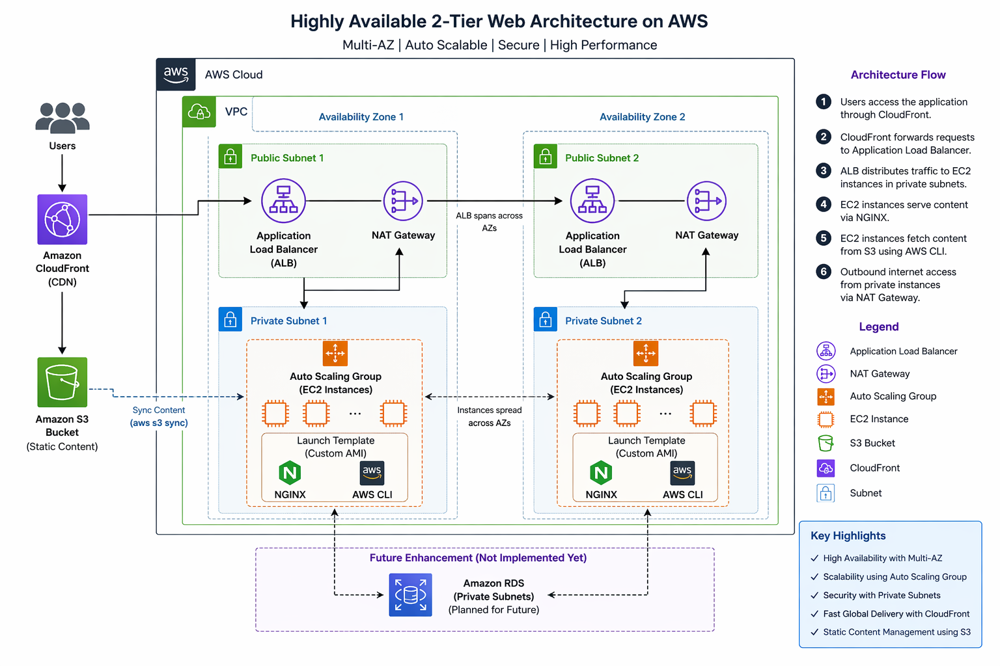

# 🚀 AWS Highly Available Web Architecture (Console-Based)

## 📌 Project Overview
This project demonstrates a highly available, secure, and scalable web architecture deployed using AWS Management Console.

The infrastructure is designed using best practices such as private subnet isolation, auto scaling, and global content delivery.

---

 ## 🏗️ Architecture Diagram

<p align="center">
  
</p>

This architecture represents a highly available AWS setup with:
- Multi-AZ deployment
- Public and Private Subnets
- Application Load Balancer
- Auto Scaling Group
- NAT Gateway for outbound access
- CloudFront for global content delivery

---

## 🛠️ Services Used
- AWS VPC
- EC2 (Auto Scaling Group)
- Application Load Balancer
- Launch Template (Custom AMI)
- S3 (Static Content Storage)
- CloudFront (CDN)
- AWS CLI
- NGINX

---

## ⚙️ Architecture Details

### 🌐 Networking Layer
- Created a custom VPC
- Used **2 Availability Zones** for high availability
- Configured:
  - 2 Public Subnets
  - 2 Private Subnets

---

### ⚖️ Load Balancer Layer (Public Subnet)
- Deployed **Application Load Balancer (ALB)** in public subnets
- Acts as the only entry point for external traffic

---

### 🔒 Compute Layer (Private Subnet)
- Deployed EC2 instances inside **private subnets**
- Managed using **Auto Scaling Group (ASG)**
- Instances are **NOT publicly accessible**
- Traffic only flows through Load Balancer

---

### 🚀 Launch Template + Custom AMI
- Created a custom AMI with:
  - AWS CLI installed
  - NGINX web server configured
- Used Launch Template in ASG for consistent instance provisioning

---

### 📦 Content Deployment (S3 → EC2)
- Created S3 bucket to store static website content
- Synced content to EC2 instances using AWS CLI:
  ```bash
  aws s3 sync s3://user-bucket-hit /usr/share/nginx/html/
